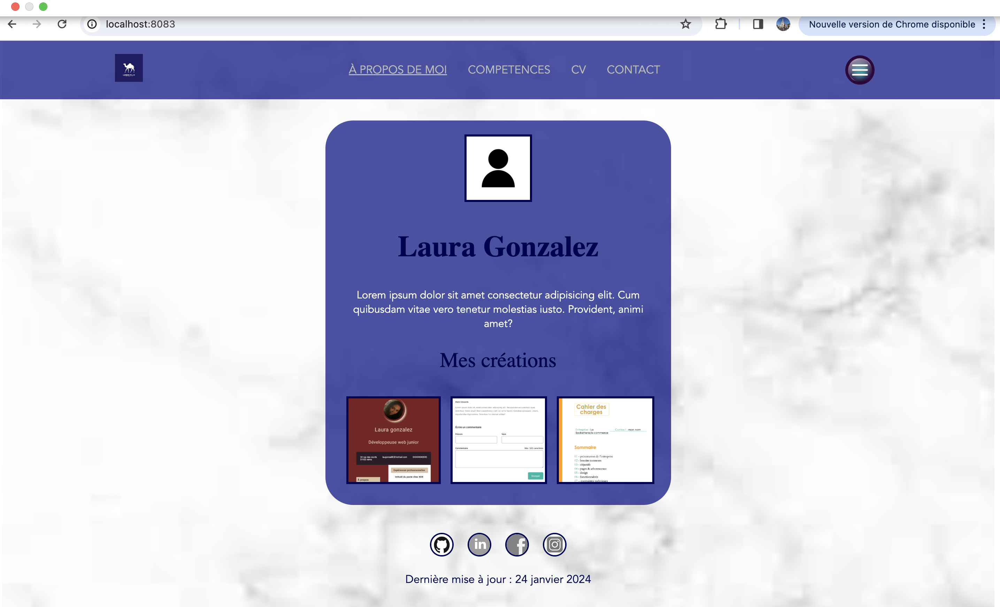

# mon-portfolio

## Prérequis
- Node.js et npm doivent être installés sur votre machine.

## Installation
1. Clonez ce dépôt sur votre machine.
```bash
git clone https://github.com/gopileau/PORTFOLIO-.git
cd PORTFOLIO-

## Project setup
```
yarn install
```

### Compiles and hot-reloads for development
```
yarn serve
```

### Compiles and minifies for production
```
yarn build
```

### Lints and fixes files
```
yarn lint
```

### Customize configuration
See [Configuration Reference](https://cli.vuejs.org/config/).



